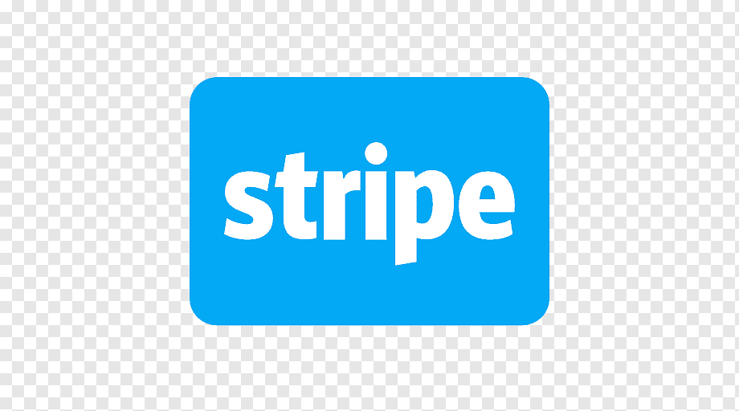
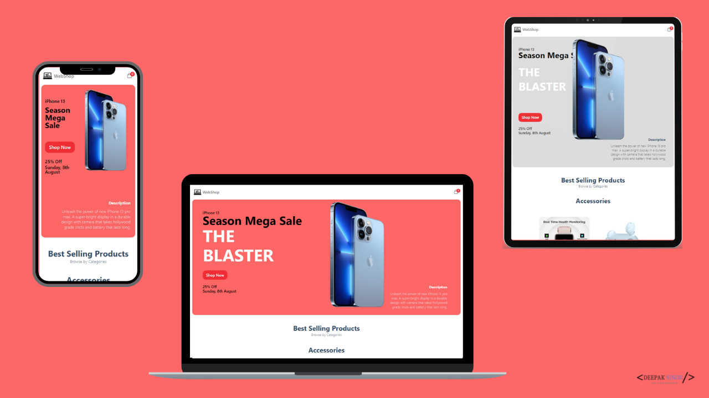
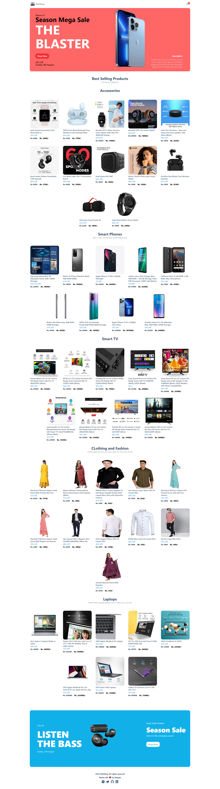
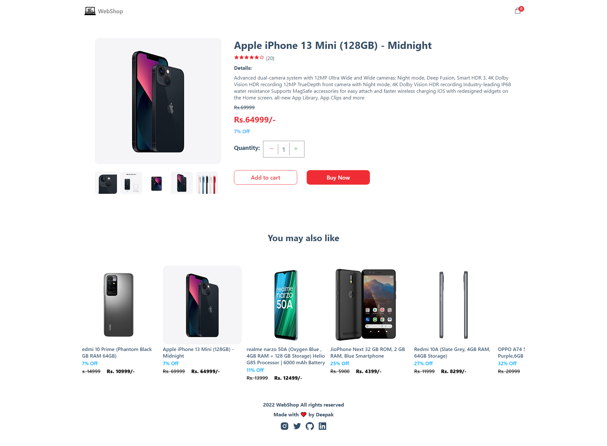
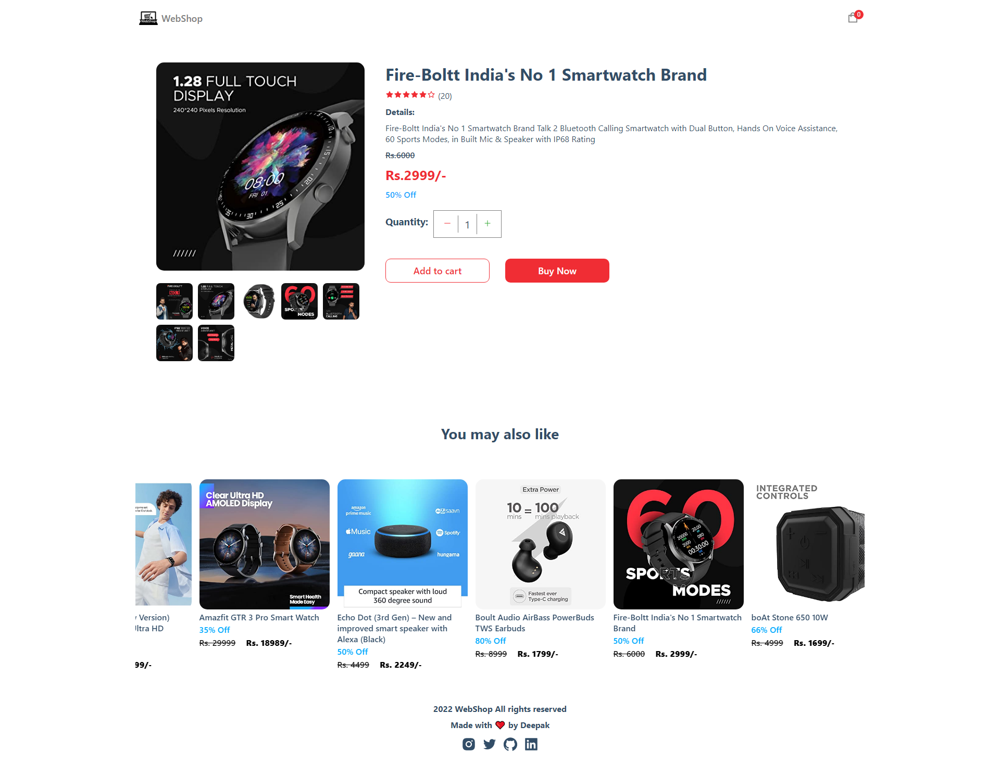
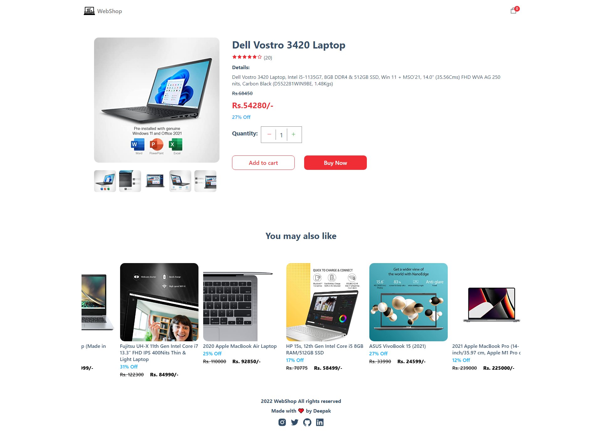
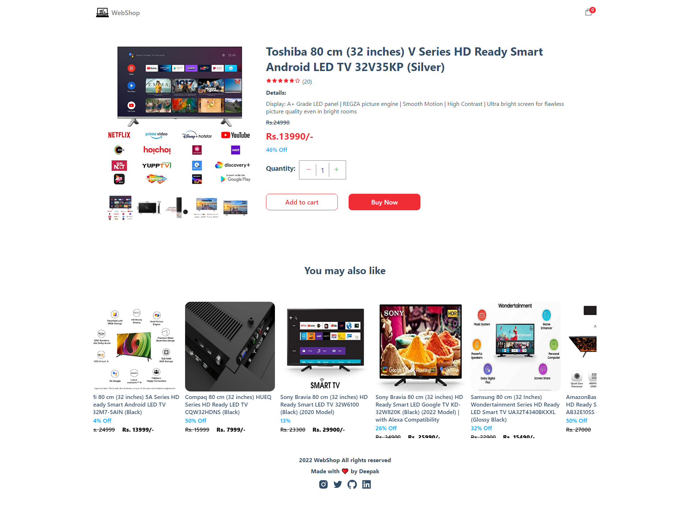
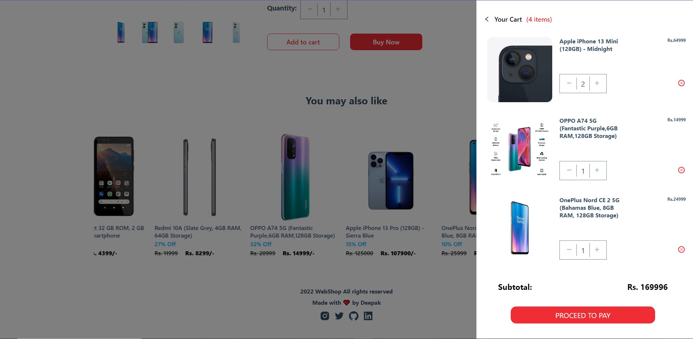

# E-Commerce WebShop

This is an modern E-Commerce application with clean and beatiful UI where users can checkout among different products, explore the product details, add the products to thier cart and check out. The application is fully responsive wuth dynamic data being pulled directly from Sanity which can be modified according to the retailers requirements.

# General Information

- This project contains the mobile responsive e-commerce application build with `React`, `Next Js` and `Sanity` to offer a modern dynamic application that will be loved by both customers and retailers. Modern design and user-friendly UI.

# Technologies Used

 `HTML`

 `CSS`

 `JavaScript`

 `React Js`

 `Next Js`

 `Sanity`

 `Stripe` (pending)

# Features
 - Build over React and Next js which stability and robust application design.
 - Contains animations which makes it more interactive to users.
 - Transitions which gives a smooth scroll feel
 - Homepage containing dynamic banners which can be modified as per requirements.
 - Dynamic product cards which can be modified as per reuirements.
 - Dynamic Prodict details page containing all information about the product
 - Add to cart feature 
 - Clean and Beautiful UI Design
 - Fully Responsive Mobile Design
 - Dynamic and Modern Design

<<<<<<< HEAD
 
=======

>>>>>>> 1534e3421a4883f93a4c17b1c93a6c5b681b3e0f
 # Website
 

 # Product Details Page
 
 ***
 
 ***
 
 ***
 

<<<<<<< HEAD
 # Cart

 
=======
 ## Cart

  

>>>>>>> 1534e3421a4883f93a4c17b1c93a6c5b681b3e0f

 # Demo

 

 # Contact

  [Linkedin](https://www.linkedin.com/in/deepaksingh5219/)

 [GitHub](https://github.com/deepak-singh5219/)

 [Instagram](https://www.instagram.com/deepak_singh_5219/)

 [Findcoder](https://www.findcoder.io/u/deepaksingh5219)

